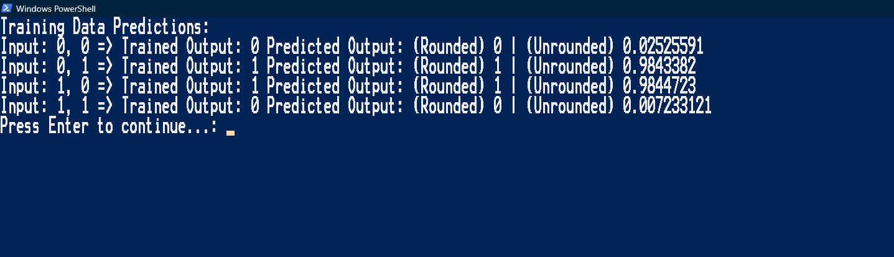

# PSMultiNeuralXOR 🧩

## Description 👨‍💻
PSMultiNeuralXOR is a PowerShell script that implements a multi-layer neural network for XOR, and or any other logic gate!
The script uses backpropagation to train the neural network and demonstrates the final predictions for the training data.

# Example 🙄

